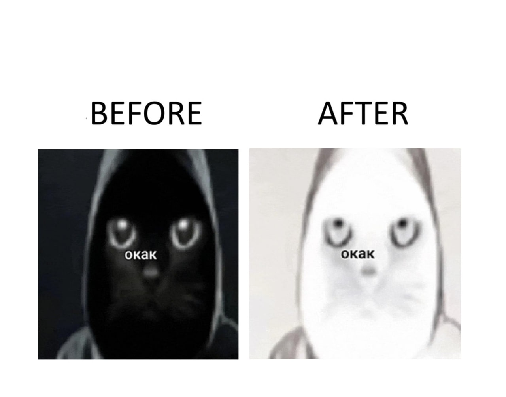
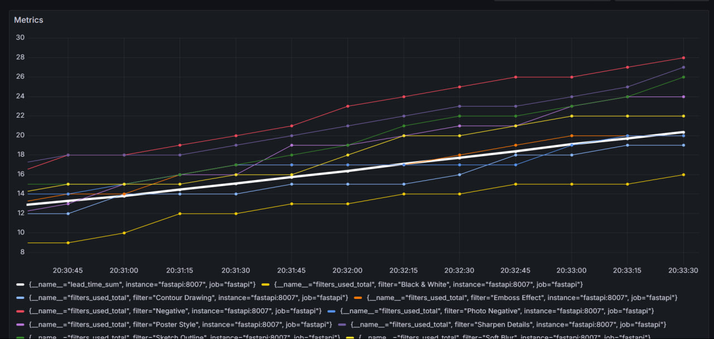

**Image Processing Service**

A service for asynchronous image filter application, built with FastAPI, RabbitMQ, PostgreSQL, Redis, and Prometheus metrics.



---

## 📋 Overview

This project provides an API for users to register, authenticate, and submit image-processing tasks. Submitted images are queued in RabbitMQ and processed by a consumer that applies various filters (Negative, Black & White, Soft Blur, etc.). Processed images are stored in PostgreSQL and can be retrieved via a streaming endpoint. The service also exposes Prometheus metrics for monitoring.

---

## 🚀 Key Features

* **User Management**: Register and login endpoints with JWT authentication.
* **Asynchronous Processing**: Task queue via RabbitMQ; non-blocking FastAPI endpoints.
* **Multiple Filters**: Support for Negative, Black & White, Soft Blur, Sharpen Details, Sketch Outline, Contour Drawing, Emboss Effect, Poster Style, Photo Negative.
* **Persistent Storage**: PostgreSQL for tasks and results; Redis for session caching.
* **Metrics & Monitoring**: Prometheus instrumentation with counters and histograms.
* **Testing**: Pytest suite covering authentication, task creation, status polling, and result retrieval.

---

## 🛠️ Tech Stack

* **Framework**: FastAPI
* **Broker**: RabbitMQ
* **Database**: PostgreSQL (via SQLAlchemy)
* **Cache**: Redis
* **Authentication**: JWT-based middleware
* **Metrics**: Prometheus (via prometheus-fastapi-instrumentator)
* **Image Processing**: Pillow (PIL)
* **Testing**: Pytest, Requests
* **Containerization**: Docker & Docker Compose

---

## 📥 Prerequisites

* Docker & Docker Compose
* Internet access (for external image URLs)

---

## 🔧 Installation & Setup

1. **Clone repository**:

```bash
git clone <repository-url>
cd <project-root>
```

2. **Configure environment**:

Copy `.env.example` to `.env` and update variables as needed:

```dotenv
rabbitmq_host=rabbitmq
rabbitmq_port=5672
rabbitmq_management_port=15672
postgres_host=db
postgres_port=5432
prometheus_port=9090
grafana_port=3000
app_host=0.0.0.0
app_port=8007
jwt_secret_key=<your-secret>
```

3. **Start services**:

```bash
docker-compose up --build
```

* FastAPI will be available at `http://localhost:8007`
* RabbitMQ management UI at `http://localhost:15672`
* Prometheus UI at `http://localhost:9090`
* Grafana UI at `http://localhost:3000`

---

## ⚙️ Configuration

All settings are managed via Pydantic in `src/config.py`. Key parameters:

* `rabbitmq_*`: RabbitMQ connection
* `postgres_*`: PostgreSQL connection
* `redis_port`: Redis port for session cache
* `jwt_*`: Secret, algorithm, expiration
* `database_url`: Full SQLAlchemy URL

Caching of settings is provided by `@lru_cache` in `get_settings()`.

---

## 🏗️ Architecture

```mermaid
flowchart LR
  User -->|HTTP| FastAPI
  FastAPI -- JWT --> AuthMiddleware
  FastAPI --> |POST /task| RabbitMQ[(task_queue)]
  RabbitMQ --> |Consumer| Consumer[Image Consumer]
  Consumer --> |Processed| PostgreSQL[(tasks table)]
  FastAPI --> |DB| PostgreSQL
  FastAPI --> |Redis| RedisCache[(session cache)]
  FastAPI --> |Metrics| Prometheus
```

---

## 📚 API Endpoints

### Authentication

* **POST /register**
  Create a new user.

  ```dotenv
  Request: { "username": "user1", "password": "pass123" }
  Response: 201 Created { "detail": "User created" }
  ```

* **POST /login**
  Authenticate and receive JWT.

  ```dotenv
  Request: { "username": "user1", "password": "pass123" }
  Response: 200 OK { "token": "<jwt_token>" }
  ```

### Task Management

* **POST /task**
  Submit an image-processing task. Requires `Authorization: Bearer <token>`.

  ```dotenv
  Request: { "photo": "<image_url>", "filter": "Soft Blur" }
  Response: 201 Created { "task_id": "<uuid>" }
  ```

* **GET /status/{task\_id}**
  Poll status (`in progress` or `ready`). Requires JWT.

  ```dotenv
  Response: { "status": "ready" }
  ```

* **GET /result/{task\_id}**
  Retrieve processed image as JPEG stream. Requires JWT.

  ```
  StreamingResponse(image/jpeg)
  ```

---

## 🛡️ Middleware

`JWTAuthMiddleware` protects all routes except `/login`, `/register`, `/docs`, `/metrics`, `/openapi.json`.

---

## 🔄 RabbitMQ Consumer

* Listens on `task_queue`.
* Decodes Base64 image, applies filter via Pillow, re-encodes.
* Publishes result to `reply_to` queue.

Consumer script: `src/consumers/image_processor/consumer.py`.

---

## 🗄️ Database Schema

* **users**: `username (PK)`, `password` (bcrypt hash)
* **tasks**: `id (UUID PK)`, `username`, `photo` (BYTEA), `filter`, `result` (BYTEA), `status`

SQLAlchemy models in `src/database/models.py`.

---

## 📈 Metrics & Monitoring

* **Histogram**: `lead_time` measures processing duration
* **Counter**: `filters_used` counts each filter application

Metrics exposed at `/metrics` for Prometheus scraping.

Prometheus config in `src/prometheus_data/prometheus.yml`.



---

## 🧪 Testing

Run test suite with Pytest:

```bash
docker-compose exec fastapi pytest src/tests
```

Tests cover user registration, login, task creation, polling, and result retrieval.

---

## 📄 License

This project is released under the MIT License.
